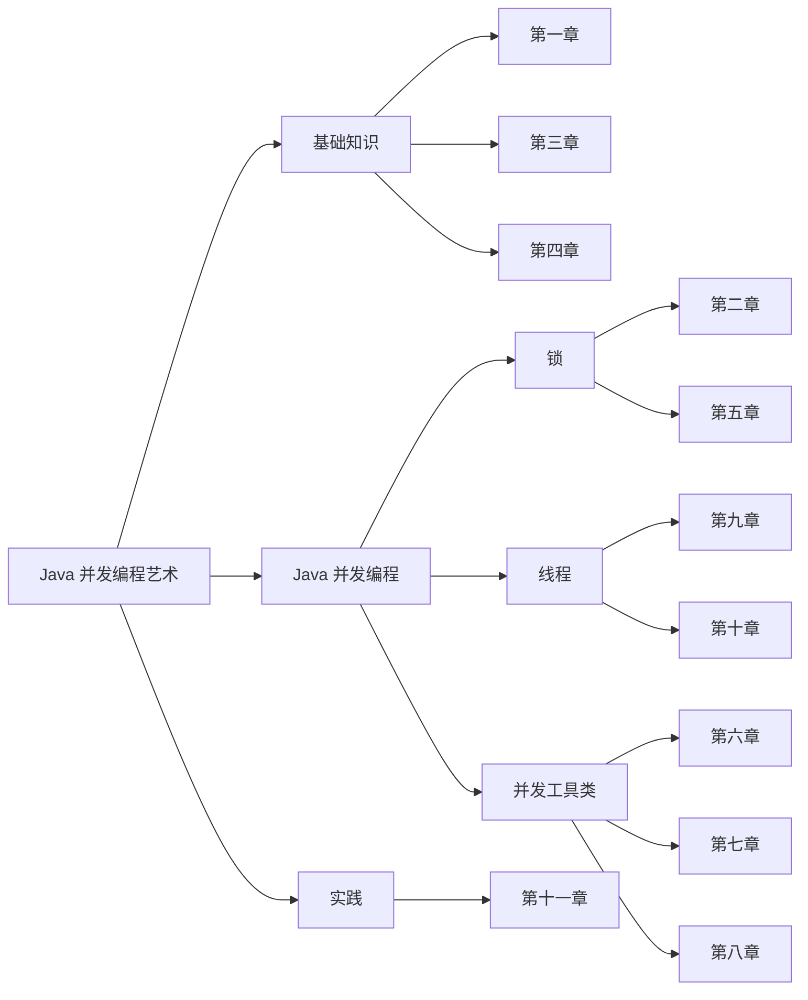
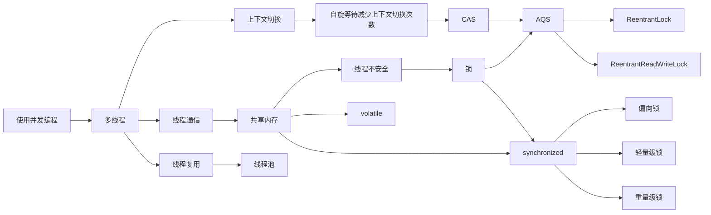

## 章节划分
`Java 并发编程艺术` 一共有11章，大致分为基础知识、Java 并发编程、实践三个部分，在阅读这本书时需要对锁、线程、cpu、内存等概念有一定的了解。





> ConcurrentHashMap 在 1.8 版本有过修改，这本书里是 1.8 之前的版本


## 并发编程 -- What

### 线程
线程是任务执行最小单元，线程内含有：
1. 计数器（Program Counter）：跟踪线程执行的下一条指令。
2. 堆栈（Stack）：存储线程的局部变量、返回地址等。
3. 寄存器（Registers）：用于存储临时数据和指令执行时使用的变量。
4. 线程上下文（Thread-specific data）：存储线程特定的数据。

并且线程中的数据变量，其他线程是无法访问的

### volatile
volatile 是 Java 中属性修饰关键字，它在 Java 中有两个作用：
1. 内存可见性
使用 volatile 修饰的变量，可以被其他线程访问
2. 禁止指令重排
编译器或者操作系统为了优化性能，可能会改变命令执行顺序，这样会导致多线程情况下出现语义不一致的问题

### CAS
CAS（Compare-And-Swap）是一种用于实现并发算法的原子操作，它基于硬件`CMPXCHG`指令，CAS 操作的步骤如下：
1. 读取内存位置的当前值。
2. 比较当前值与预期值。
3. 如果当前值与预期值相等，则将内存位置更新为新值，并返回 true，表示操作成功。
4. 如果当前值与预期值不相等，则不进行更新，并返回 false，表示操作失败。

> CAS 相关方法封装在`Unsafe`类中，需要注意 CAS 与 Java 中自旋锁并不等同，自旋锁是基于CAS，类似使用一个死循环，不断调用 CAS 直到返回 true


### AQS
AQS 是 Java 并发工具包下的一个抽象类 `AbstractQueuedSynchronizer`，是JUC下锁的模板方法类，这个类定义中将锁的类型划分两种类型：
1. EXCLUSIVE (独占)
2. SHARED （分享）

AQS 基于 volatile 和 `Unsafe` 中 CAS 相关方法实现锁


### synchronized
synchronized 是 Java 中区别与 JUC 下 AQS 锁的另一种选择，synchronized 可以根据锁竞争情况来选择使用什么锁，这个过程可以称之为锁升级


> synchronized 锁只能升级不能降级

synchronized 锁相关信息会放在 Java 对象头中，不同的锁对象头内容不一样：

```bash
无锁状态（Normal Object）
+---------------------------------+
| Hash Code (25 bits)             |
| Age (4 bits)                    |
| Mark (3 bits, 001)              |
+---------------------------------+

偏向锁状态（Biased Locking）
+---------------------------------+
| Thread ID (54 bits)             |
| Epoch (2 bits)                  |
| Age (4 bits)                    |
| Mark (3 bits, 101)              |
+---------------------------------+

轻量级锁状态（Lightweight Locking）
+---------------------------------+
| Lock Record Pointer (62 bits)   |
| Mark (2 bits, 00)               |
+---------------------------------+

重量级锁状态（Heavyweight Locking）
+---------------------------------+
| Monitor Pointer (62 bits)       |
| Mark (2 bits, 10)               |
+---------------------------------+

```
- 偏向锁存放的是偏向线程ID
- 轻量级锁存放的是指向线程栈的指针，而线程栈中的内容是 CAS 写入的对象头内容
- 重量级锁存放的是指向`Monitor`指针，而原始对象头中的内容也保存在`Monitor`中


## 并发编程 -- How
在实际工作中并发编程都是基于业务需求，根据业务需求与项目情况来选择合适并发工具，Java AQS 衍生出许多并发工具类，例如：
- Semaphore，用于限制资源使用的场景，例如限流
- Future，获取异步结果，在实际业务需求中如果某段代码需要限制执行时间，可以使用Future来实现

在实际业务中大部分情况都是基于 Redis 加锁，因为 Java 原生的锁在分布式情况下无法实现资源安全，因为多台主机之间内存是隔离的；

基于 Redis 加锁需要注意：
- 加锁的原子性操作
- 业务执行超时导致锁自动释放
- 不可重入
- Redis 集群锁不同步问题


## 并发编程 -- Why
并发编程是一种利用多线程处理任务的方式，期望使用这种方式来提高资源利用率，在如今互联网中并发编程是不可缺少的一环，使用并发编程需要对cpu、线程、锁、内存有一定了解，因为它们都是环环相扣的；




Java 锁的设计很经典，其中内含的思想在其他地方都有应用，例如 MySQL 中 X 和 S 锁以及 MVCC 模式，都是尽量减少锁的颗粒度，减少线程对于锁的竞争
