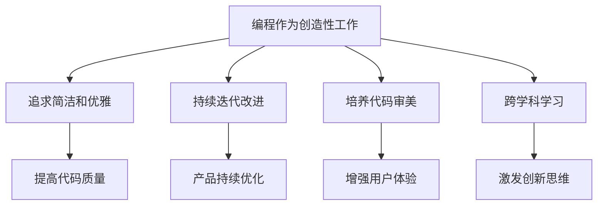
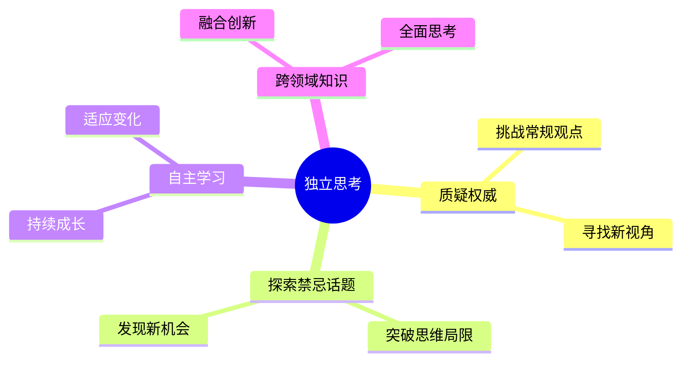

## 引言
《黑客与画家》是一本实用性的书籍，这本书讲述作为黑客[^1]应该具备什么样的特征、精神，并且告诉读者在应该怎么样去做一个黑客。在这本书中还讲述了财富的定义，帮助读者怎么了解和认识财富以及怎么创造财富。这个本书对于开发、创业都具有重要的参考价值。

## 编程与艺术
编程与艺术都属于创造性工作，所以在艺术创作过程中总结出关键点也适用于编程开发

### 对于开发人员应该做到
- 追求代码的简洁和优雅，就像画家追求构图的平衡
- 不断迭代和改进，类似艺术家反复修改作品
- 培养审美能力，不仅关注功能，也注重代码的"美"
- 跨学科学习，汲取艺术、设计等领域的灵感

## 打破常规思维模式
### 独立思考是创新和突破的基础

- 帮助发现被忽视的机会
- 培养解决复杂问题的能力
- 在竞争中获得独特优势

### 培养批判性思维

- 养成质疑习惯，不盲目接受权威观点
- 主动探索不同领域的知识，拓宽思维边界
- 鼓励团队中的不同声音，营造开放的讨论氛围
- 实践自主学习，不依赖传统教育体系

## 财富
### 财富的概念
财富并不等于钱，财富是被创造出来，钱只是财富一种表示方式，作者深刻描述了财富是等价于对他人有价值的事物，只要创造出对他人有价值的事物，就是在创造财富。

### 怎么成功创造财富

1. 发现机会
通过打破固有的思维模式，来发现机会。

3. 放大投入
在发现机会时加大投入，无论成功或者失败，不断尝试。

## 总结
《黑客与画家》不仅是一本关于编程的书，更是一本关于如何在数字时代中思考、创新和创造价值的指南。通过将编程视为艺术、强调解决实际问题的创新、培养独立思考，以及明智地利用技术工具，我们可以在快速变化的世界中保持竞争力和创造力。

[^1]:在这本书中黑客是指优秀的开发人员
